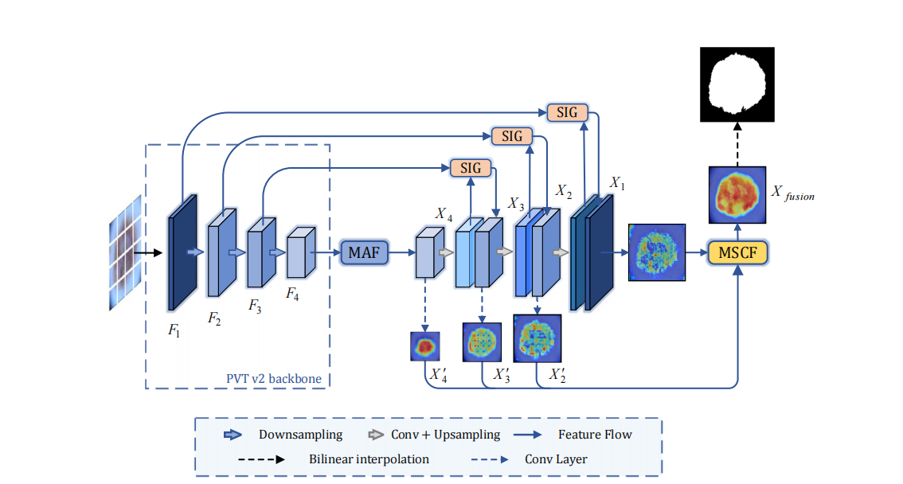

# MASDF-Net
This repo holds the code of "MASDF-Net: A multi-attention codec network with selective and dynamic fusion for skin lesion segmentation."

## Model Overview

      

## Experiments

### ISIC2017 Skin Lesion Segmentation Challenge
GPUs of memory>=4G shall be sufficient for this experiment. 

1. Preparing necessary data:
	+ downloading ISIC2017 training, validation and testing data from the [official site](https://challenge.isic-archive.com/data), put the unzipped data in `./data`.
	+ run `process.py` to preprocess all the data, which generates `data_{train, val, test}.npy` and `mask_{train, val, test}.npy`.

2. Testing:
	+ run `test_isic.py --ckpt_path='snapshots/XXXX.pth'`.

3. Training:
	+ run `train_isic.py`; you may also want to change the default saving path or other hparams as well.

Code of other tasks will be comming soon.

## Reference
Some of the codes in this repo are borrowed from:
* [TransFuse](https://github.com/Rayicer/TransFuse)
* [PVT](https://github.com/whai362/PVT)
* [Polyp-PVT](https://github.com/DengPingFan/Polyp-PVT)

## Questions
Please drop an email to fujinghao@stu.scu.edu.cn
